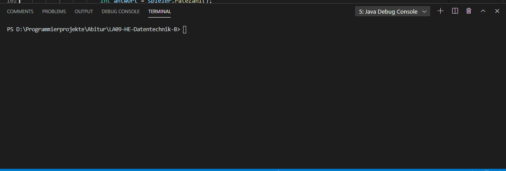

# LA09-HE-Datentechnik-B
Implementation of "Mastermind" and "VideoCity"-Database from Landesabitur 2009 Hessen in "Datentechnik"

## Table of Contents
  - [Preview](#preview)
  - [Stats](#stats)
  - [Clone](#clone)
  - [License](#License)
## Preview


## Stats


## Clone
> You need 'Java 1.8 or higher' for mastermind

> Database was made with 'Microsoft Access'

- Enter the following command
```shell
$ git clone https://github.com/CodingTarik/LA09-HE-Datentechnik-B.git
```
## License

